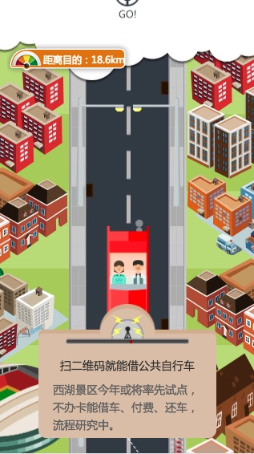
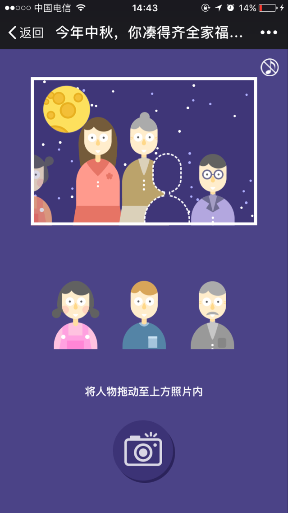
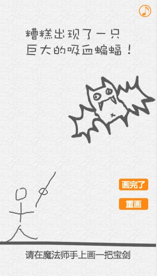
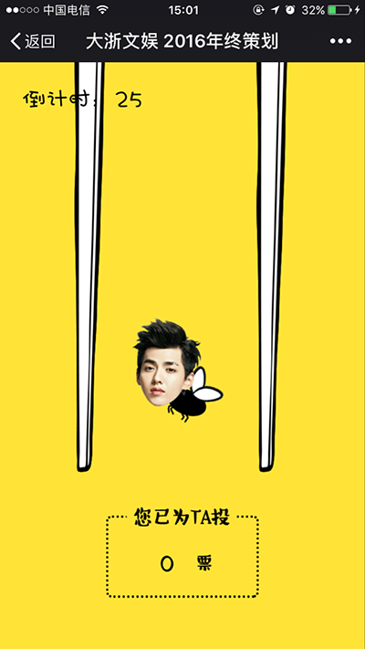
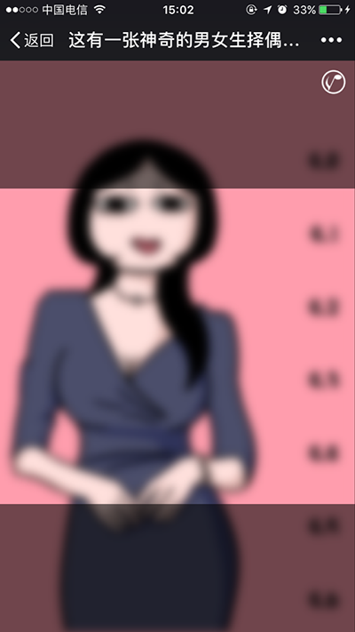
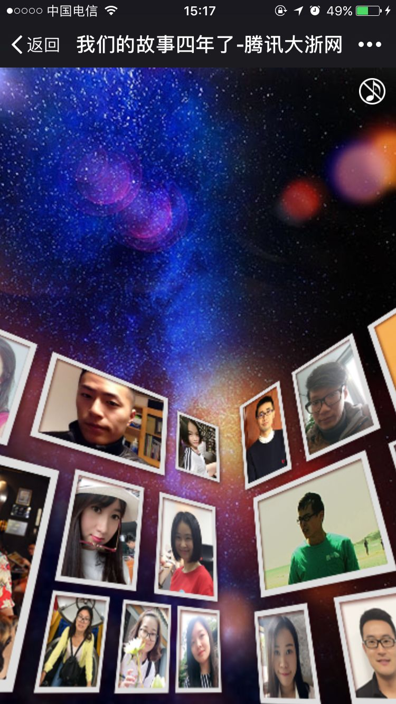
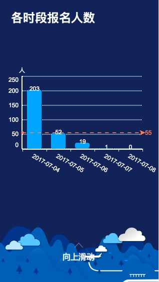
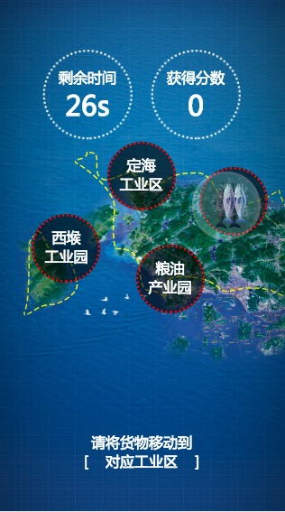
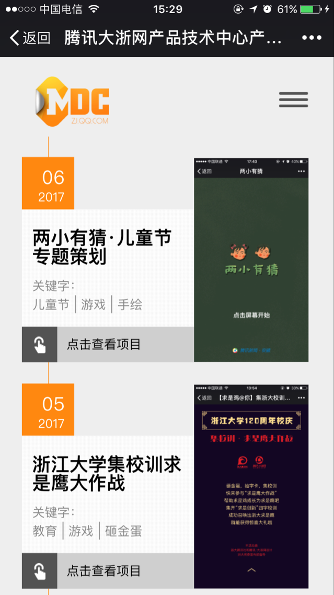

我做过的h5
===================
最近一段时间一直在做项目的整理和总结，现在这个是我做过的h5页面的集合吧，也会整理一个做过的[pc端页面的集合](https://github.com/yuwanli/collection-pc-page)，入前端这行也就两年多的时间，但是做过的pc和h5确实数不胜数，在公司的cms做了一个大致的检索（我的项目习惯用ywl_来命名），结果有17页，每页20条（/捂脸），算下来得有三百多个。这里就不一一列举了。由于公司性质的原因，经常会做一些简单的h5，还有节点性（特定节日、特定活动）的h5，这种的话一般是小游戏类的，较为复杂点的。

本人只是一个前端菜鸟，以下所有有理解错误的地方欢迎大家留言指正。

那h5的话，避不开的话题就是用什么插件和用什么库，我常用的插件有以下这些，我做过的h5也将用这个做区分：

### [swiper](http://www.swiper.com.cn/)

swiper是目前应用较广泛的移动端网页触摸内容滑动js插件。相信大家肯定对swiper不陌生，在平时的开发过程中，一般是在较为紧急的情况下会选择用swiper来做快速开发。后面会讲一个遇到的问题，swiper的单页希望能单页滚动，且能上拉下拉翻页。

1，常规的翻页形式的h5：

介绍性的

- [浙大120年校庆邀请函](http://zj.qq.com/zt2016/invitation/index.htm)
- [2016招聘h5](http://zj.qq.com/money/dzw_recruit.htm)
- [http://zj.qq.com/money/ywl_loushi.htm](http://zj.qq.com/money/ywl_loushi.htm)
- [http://zj.qq.com/money/ywl_simida.htm](http://zj.qq.com/money/ywl_simida.htm)
- [http://zj.qq.com/money/ywl_drama.htm](http://zj.qq.com/money/ywl_drama.htm)
- [http://zj.qq.com/money/internet.htm](http://zj.qq.com/money/internet.htm)
- [http://zj.qq.com/money/ywl_blood_test.htm](http://zj.qq.com/money/ywl_blood_test.htm)
- [http://zj.qq.com/money/ywl_hundred.htm](http://zj.qq.com/money/ywl_hundred.htm)
- [http://zj.qq.com/money/ywl_shiyan_school.htm](http://zj.qq.com/money/ywl_shiyan_school.htm)
- [http://zj.qq.com/money/ywl_g20_wmcx.htm](http://zj.qq.com/money/ywl_g20_wmcx.htm)
- [http://zj.qq.com/money/ywl_qiaosi_prison.htm](http://zj.qq.com/money/ywl_qiaosi_prison.htm)
- [http://zj.qq.com/money/ywl_edu_liuxue.htm](http://zj.qq.com/money/ywl_edu_liuxue.htm)
- [http://zj.qq.com/money/ywl_qiaosi_wisdom.htm](http://zj.qq.com/money/ywl_qiaosi_wisdom.htm)

- [http://zj.qq.com/zt2016/expositionh5/index.htm](http://zj.qq.com/zt2016/expositionh5/index.htm)
> 这个h5就遇到了上面提到的那个问题，这里使用的方式是内嵌swiper的方式（其实不是很好的处理方式），内部swiper通过设置freeMode、freeModeMomentum、freeModeMomentumBounce等属性可以实现单长页，通过监听内部的swiper的onReachEnd和onReachBeginning事件来判断是否滑倒底部或者顶部，然后做翻页的动作。在实现的过程中会有一些bug，具体的不展开分析了。若有小伙伴碰到类似的需求直接右键源码，拷贝相应的js和css即可使用。

互动性的

- [2016年终策划-大事记](http://zj.qq.com/zt2016/2016hz/index.htm)

> 合理的运用swiper，可以做一个类似这样不一样互动效果的h5，具体做法不展开分析了，主要用了一个内嵌的swiper，同上面所诉的方式，然后就是利用'swiper-slide-active'和css来控制节点的显示和隐藏。所以这里有一个技巧就是要把一个长图切碎，每一个碎片做为一个内置swiper的slide，节点放在对应的slide里即可，然后组合css3的动画就可以了。这一套模板公司内部复用好几次，后面两个是复用版本，只是切换图片和文字而已。

- http://zj.qq.com/zt2016/nbfuture/index.htm
- http://zj.qq.com/zt2017/rgdsj/index.htm

--------------------
### [phaser](http://www.phaser.io/)

这里不展开讲phaser了，后面专门写一篇关于使用该[游戏框架](https://github.com/yuwanli/phaser-collection/blob/master/README.md)的，挑选几个游戏具体分享下我是如何使用phaser。

- [2016中秋策划-凑齐全家福](http://zj.qq.com/zt2016/zqqjf/index.htm)

- [必胜客万圣节策划](http://zj.qq.com/money/ywl_game_halloween.htm)

- [腾讯大浙网鸡年新春送福](http://mat1.gtimg.com/zj/yuwanli/dzw1702/product/index.html)

- [2016年终策划-重走2016](http://mat1.gtimg.com/zj/yuwanli/dzw1612/news_yearPlan/index.html)

- [2016年年度黑企鹅奖](http://mat1.gtimg.com/zj/yuwanli/dzw1701/entPlan/index.html)

--------------------

### [pixi](http://www.pixijs.com/)

Pixi.js使用WebGL,是一个超快的HTML5 2D渲染引擎。phaser内部使用的也就是pixi。其实以下这两个h5主要是用了陀螺仪(deviceorientation)，用pixi只是不想手动用js去写canvas。

- [以下两个游戏的基本模型demo](http://zj.qq.com/money/ywl_game_demo.htm)

- [http://zj.qq.com/money/ywl_fyyy.htm](http://zj.qq.com/money/ywl_fyyy.htm)

- [2016七夕策划-视力表](http://zj.qq.com/money/ywl_qixi_game.htm)

--------------------

### [createjs](https://github.com/CreateJS)

CreateJS是基于HTML5开发的一套模块化的库和工具。基于这些库，可以非常快捷地开发出基于HTML5的游戏、动画和交互应用。简单的说就是游戏框架，Adobe Animate CC 制作的动画，可直接导出基于CreateJS的html和js，前端人员可以直接使用。下面是最近才做的一个项目，[舟山好网民](http://zj.qq.com/money/ywl_zhoushan_test.htm)，具体的可以点击查看，解析如何快速使用。

- [舟山好网民](http://zj.qq.com/money/ywl_zhoushan_test.htm)

--------------------

### [skroll](https://github.com/Prinzhorn/skrollr)

skroll是视差滚动插件，实现的是一种视觉效果，要实现酷炫的效果必须有好的剧本，有设计的全力配合，不然依靠前端去做出的效果会很生硬，下面给出的是比较失败的例子（/捂脸）。

- [http://zj.qq.com/money/ywl_conference.htm](http://zj.qq.com/money/ywl_conference.htm)
- [http://zj.qq.com/money/ywl_product_commit.htm](http://zj.qq.com/money/ywl_product_commit.htm)
- [http://zj.qq.com/money/ywl_shaoxing_birth_test.htm](http://zj.qq.com/money/ywl_shaoxing_birth_test.htm)

--------------------

### [css3d](https://github.com/shrekshrek/css3d-engine)

css3d是一个伪3d的插件，基于div+css3实现,相对canvas webgl拥有更好的平台兼容性，但是也指局限实现基本的3d效果。说到这个，不得不提淘宝做的[造物节](http://show.im20.com.cn/zwj/)的策划，当时第一次看到这个h5的时候，以为是用的webgl，但是简单看了下发现就是一堆div和css，就被震惊到了，用css就能实现这样的3d效果，然后找到他们使用的这个插件，然后在公司四周年的策划的时候想到了用这个插件。

四周年策划，是视频、音频、动画的一个结合，预期是打造出一个高逼格的h5。然后，最终呈现的效果很差，这个项目算是很失败，在很长的一段时间里都很苦恼这件事，怀疑自己的能力。后来总结了下，项目进行中确实存在满多问题，时间上，一周的时间导致没有时间去完善很细致的动画，遇到问题也不能及时解决（没有能问的人，网上相关这个插件的资料少）。沟通上，太零碎太碎片了，导致反复的修改，效率很低。

[四周年策划](http://mp.weixin.qq.com/s/n9SLBcP1iajzKop9Sq9-xw)

--------------------

### [vue](https://cn.vuejs.org/)

下面这个项目是我的[vue初体验](https://github.com/yuwanli/start-with-vue)(简直想死)，这里就不赘述了。

[http://zj.qq.com/money/ywl_zhxy_invite.htm](http://zj.qq.com/money/ywl_zhxy_invite.htm)

--------------------

### [sui](https://github.com/sdc-alibaba/SUI-Mobile)

SUI Mobile 是阿里巴巴国际UED前端团队出品的移动端 UI库。当时做的是一个企业号下面的功能页面，这里没法给出入口供体验，这个库给我的感觉就是轻、兼容性好、体验好、使用便捷。个人还是喜欢比较完善（有官网、有demo、有api、有示例）一点的框架，对于前端菜鸟来说，能快速上手是一件比较重要的事。

--------------------

### [echarts](https://github.com/ecomfe/echarts)

ECharts，一个纯 Javascript 的图表库，可以流畅的运行在 PC 和移动设备上，兼容当前绝大部分浏览器（IE8/9/10/11，Chrome，Firefox，Safari等），底层依赖轻量级的 Canvas 类库 ZRender，提供直观，生动，可交互，可高度个性化定制的数据可视化图表。
很是腻害的一个库，基于这个库可以做很多东西，我这里没有太深入研究这个echarts，项目复杂度没有那么高。

- [活动数据分析](http://zj.qq.com/APP/dz_members_analysis.htm?id=3996)

--------------------

### zepto

前面说了用各种插件快速开发，但有的时候，项目不大，使用swiper等插件的时候觉得会很累赘，这个时候我会只用一个zepto，使用它swipeDown、swipeUp、tap等来实现翻页，或者结合其他的框架来做一个h5。

- [答题类](http://zj.qq.com/zt2016/dz_xiao/index.htm)
- [三周年邀请函](http://zj.qq.com/money/ywl_invitation.htm)
- [http://zj.qq.com/money/ywl_invition_test3.htm](http://zj.qq.com/money/ywl_invition_test3.htm)
- [http://zj.qq.com/money/ywl_invition_test2.htm](http://zj.qq.com/money/ywl_invition_test2.htm)
- [http://zj.qq.com/money/ywl_invition_test1.htm](http://zj.qq.com/money/ywl_invition_test1.htm)
- [http://zj.qq.com/money/ywl_linan_travel.htm](http://zj.qq.com/money/ywl_linan_travel.htm)
- http://zj.qq.com/money/ywl_house_widsom_test.htm
- [运河庙会报名页](http://zj.qq.com/money/ywl_dyh_upload.htm)
- [运河庙会结果集合](http://zj.qq.com/money/ywl_dyh_vote.htm)
- [运河庙会个人页](http://zj.qq.com/money/ywl_dyh_index.htm?aid=2133&pid=1619)

- [拖拽类的小游戏](http://zj.qq.com/money/ywl_zhoushan_game.htm)

- [我第一个策划类的h5-感恩节](http://zj.qq.com/money/ywl_thanksgiving2.htm)

以上这些都可以通过关注大浙产品中心公众号，里面会收集优秀的h5产品。

